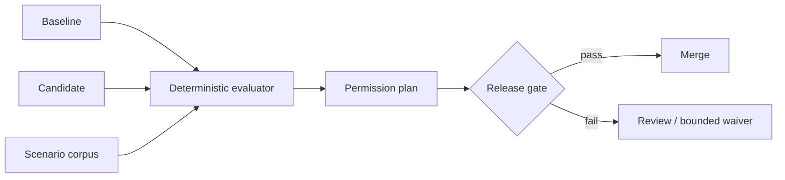

<p align="center">
  
</p>

<p align="center">
  <strong>Know exactly when an AI agent gains more power.</strong><br>
  Deterministic permission plans and CI gates for tool-calling agents.
</p>

<p align="center">
  <a href="https://github.com/TensorScholar/permitdiff/actions/workflows/ci.yml"></a>
  <a href="https://github.com/TensorScholar/permitdiff/actions/workflows/security.yml"></a>
  <a href="https://scorecard.dev/viewer/?uri=github.com/TensorScholar/permitdiff"></a>
  
  <a href="LICENSE"></a>
</p>

<p align="center">
  
</p>

## Why PermitDiff

A text diff shows that policy YAML changed. It does **not** prove whether an agent can now perform an action that was previously denied or required human approval.

PermitDiff evaluates one review corpus against both policies and emits an auditable permission plan.

| Detects | Example |
|---|---|
| **Privilege expansion** | `deny → allow` |
| **Approval bypass** | `require_approval → allow` |
| **Coverage drift** | New rule has no scenario |
| **Unsafe defaults** | Fallback changes to `allow` |
| **Stale exceptions** | Waiver expired or unused |

## Five-minute start

```bash
pipx install git+https://github.com/TensorScholar/permitdiff.git
permitdiff init permissions && cd permissions
permitdiff compare policies/baseline.yaml policies/candidate.yaml corpus.jsonl \
  --gate permitdiff-gate.yaml
```

Exit `0` = pass · `2` = valid comparison blocked by policy · `1` = invalid input or execution.

## Architecture



- **No LLM in the decision path** — deterministic, local, reproducible.
- **Evidence-first** — canonical digests, action fingerprints, JSON, Markdown, SARIF.
- **Fail-closed** — untrusted MCP-style annotations cannot authorize actions.
- **Bounded waivers** — exact scenario + transition + reason + expiry.

## GitHub Action

```yaml
- uses: actions/checkout@v6
- uses: actions/setup-python@v6
  with: { python-version: "3.13" }
- uses: TensorScholar/permitdiff@v0
  with:
    baseline: permissions/policies/baseline.yaml
    candidate: permissions/policies/candidate.yaml
    corpus: permissions/corpus.jsonl
    gate: permissions/permitdiff-gate.yaml
```

The action writes a Markdown step summary and a SARIF report for code scanning.

## Scope

PermitDiff is a **release-control layer**, not a runtime authorizer, sandbox, identity provider, or proof of exhaustive corpus coverage. Review the [methodology](docs/methodology.md), [threat model](docs/threat-model.md), and [limitations](docs/limitations.md) before sensitive use.

## Trust & delivery

The release pipeline is configured for Python 3.11–3.14 tests, branch-aware coverage, strict typing, linting, dependency audit, CodeQL, OpenSSF Scorecard, clean-wheel smoke tests, CycloneDX SBOMs, Trusted Publishing, checksums, and GitHub build attestations.

**Commercial adoption:** permission architecture reviews, scenario-corpus design, CI rollout, policy migration, and private adapters. [Engagement model →](docs/commercial-support.md)

`0.1.0rc1` is a release candidate using the versioned `v1alpha1` schema. Breaking changes remain possible before `v1`.

[Docs](docs/) · [Security](SECURITY.md) · [Contributing](CONTRIBUTING.md) · [Roadmap](ROADMAP.md) · [Citation](CITATION.cff)
