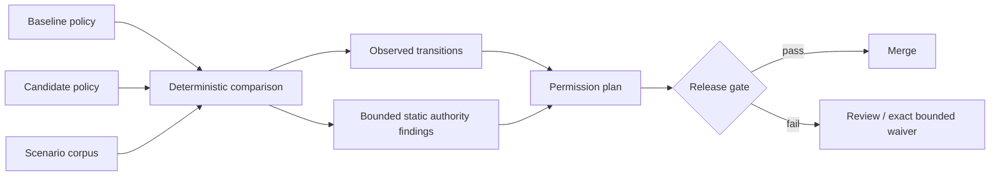

<p align="center">
  
</p>

<p align="center">
  <strong>Know exactly when an AI agent gains more power.</strong><br>
  Deterministic permission plans and CI gates for tool-calling agents.
</p>

<p align="center">
  <a href="https://github.com/TensorScholar/permitdiff/actions/workflows/ci.yml"></a>
  <a href="https://github.com/TensorScholar/permitdiff/actions/workflows/security.yml"></a>
  <a href="https://scorecard.dev/viewer/?uri=github.com/TensorScholar/permitdiff"></a>
  
  <a href="LICENSE"></a>
</p>

<p align="center">
  
</p>

## Why PermitDiff

A text diff shows that policy YAML changed. It does **not** tell a reviewer what new authority became reachable.

PermitDiff evaluates the same review corpus against baseline and candidate policies **and** performs bounded static authority analysis over the policy change. The result separates observed scenario evidence from conservative policy-level findings.

| Detects | Example |
|---|---|
| **Observed privilege expansion** | scenario resolves `deny → allow` |
| **Approval bypass** | `require_approval → allow` |
| **Scope widening** | `payments.refund → payments.*` |
| **Constraint weakening** | `amount <= 100 → amount <= 10000` |
| **Coverage drift** | New rule has no observed scenario |
| **Unsafe defaults** | Fallback becomes more permissive |
| **Precedence uncertainty** | Mixed-effect rules change order |
| **Stale exceptions** | Waiver expired, drifted, or unused |

When bounded static analysis cannot prove a changed construct non-expanding, the result is `unknown` and the strict gate fails closed. PermitDiff does not convert uncertainty into safety.

## Five-minute start

```bash
pipx install git+https://github.com/TensorScholar/permitdiff.git@v0.1.0rc2
permitdiff init permissions && cd permissions
permitdiff compare policies/baseline.yaml policies/candidate.yaml corpus.jsonl \
  --gate permitdiff-gate.yaml
```

Exit `0` = pass · `2` = valid comparison blocked by policy · `1` = invalid input or execution.

## Native Claude Code preapproval projection

The post-`v0.1.0rc2` development line adds a bounded native on-ramp for Claude Code project settings. It projects a documented subset of `permissions.allow` into the same semantic engine used by PermitDiff policies instead of reducing native rules to a text or rank diff.

```bash
permitdiff claude compare \
  .claude/settings.baseline.json \
  .claude/settings.local.json \
  corpus.jsonl \
  --strict \
  --format markdown
```

The initial adapter accepts only explicit `permissions.defaultMode = "dontAsk"` pairs whose `deny` and `ask` rules are unchanged. It translates bare tool preapprovals and exact `WebFetch(domain:HOST)` preapprovals, de-noises documented same-effect redundancies such as `Bash(git mv *)` when bare `Bash` is already granted, and fails closed when changed native semantics cannot be represented faithfully.

This is a **preapproval projection, not a complete Claude effective-authority importer**. Non-`permissions` root settings are not modeled; the evidence record exposes their key names and identifies which ignored root keys changed. If such root settings differ, comparison stops unless the reviewer explicitly passes `--allow-ignored-root-changes`. That flag acknowledges only that the reviewer wants to analyze the bounded permission projection; it does not approve or waive the ignored changes.

Claude Code's current documentation states that domain-scoped WebFetch rules can also affect sandbox network-domain policy. PermitDiff models exact `WebFetch(domain:HOST)` rules here only as WebFetch preapprovals. If exact WebFetch domain preapprovals change, comparison stops unless the reviewer passes `--acknowledge-webfetch-sandbox-gap`. This acknowledgement allows analysis of the preapproval projection only; it is not evidence that sandbox/network consequences were reviewed or accepted.

`WebFetch(domain:*)` is intentionally **not** collapsed into bare `WebFetch`; a changed wildcard-domain rule is unsupported and fails closed because the two forms have different sandbox effects. The public regression pilot also changes `enabledPlugins`, so its two reported expansions are specifically the two modeled `permissions.allow` preapproval expansions—not a claim about the entire settings file.

The adapter also does not model managed/user overrides, hooks, plugin-provided capabilities, built-in exceptions, other permission modes, or arbitrary Bash/path matching. `WebFetch` domain scenarios use reserved `_claude.permission_domain` review metadata created for normalization; that field is not claimed to be raw Claude tool input.

Use `--evidence-output <path>` when you need the adapter's normalization record. The evidence records whether each projection gap was explicitly acknowledged, but can also contain native permission-rule text and should be treated as potentially sensitive review material rather than automatically published CI output.

## Architecture



- **No LLM in the decision path** — deterministic, local, reproducible.
- **Semantics over text** — rule effects, scopes, constraints, defaults, and precedence matter; descriptions do not grant authority.
- **Two evidence channels** — observed scenario transitions remain distinct from bounded static authority findings.
- **Fail-closed** — invalid inputs and unresolved static semantics do not become `allow` or `pass`.
- **Evidence-first** — policy/corpus digests, action/finding fingerprints, JSON, Markdown, SARIF.
- **Bounded waivers** — observed transitions and policy-level findings require exact, expiring review evidence; static waivers are bound to baseline/candidate digests.

## GitHub Action

```yaml
- uses: actions/checkout@v6
- uses: actions/setup-python@v6
  with: { python-version: "3.13" }
- uses: TensorScholar/permitdiff@v0.1.0rc2
  with:
    baseline: permissions/policies/baseline.yaml
    candidate: permissions/policies/candidate.yaml
    corpus: permissions/corpus.jsonl
    gate: permissions/permitdiff-gate.yaml
```

The action writes a Markdown step summary and a SARIF report for code scanning.

## Scope

PermitDiff is a **release-time semantic permission regression gate**. It is not a runtime authorizer, credential broker, sandbox, identity provider, generic behavioral evaluator, or proof of exhaustive authorization safety.

Observed scenario coverage is not proven policy coverage. The built-in static analyzer deliberately handles a bounded semantic subset and reports unsupported or ambiguous containment as `unknown`. Review the [methodology](docs/methodology.md), [threat model](docs/threat-model.md), and [limitations](docs/limitations.md) before sensitive use.

## Trust & delivery

The release pipeline is configured for Python 3.11–3.14 tests, branch-aware coverage, strict typing, linting, dependency audit, CodeQL, OpenSSF Scorecard, clean-wheel smoke tests, CycloneDX SBOMs, Trusted Publishing, checksums, and GitHub build attestations. The `v0.1.0rc2` release execution completed artifact build, external-repository validation, checksums, artifact attestation, SBOM attestation, and GitHub Release creation. PyPI publication is not yet claimed.

**Commercial adoption:** permission architecture reviews, scenario-corpus design, CI rollout, policy migration, and private adapters. [Engagement model →](docs/commercial-support.md)

`0.1.0rc2` is the latest GitHub release candidate using the versioned `v1alpha1` schema. Mutable `main` advances under a separate development identity after releases; breaking changes remain possible before `v1`.

[Docs](docs/) · [Security](SECURITY.md) · [Contributing](CONTRIBUTING.md) · [Roadmap](ROADMAP.md) · [Citation](CITATION.cff)
